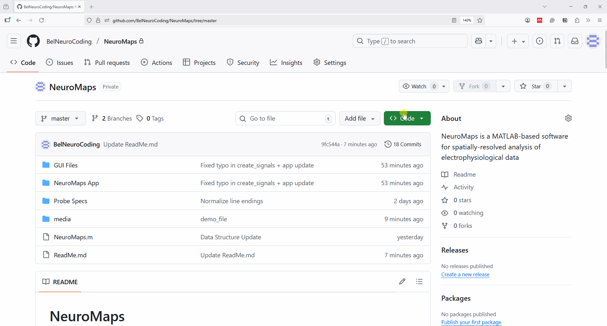
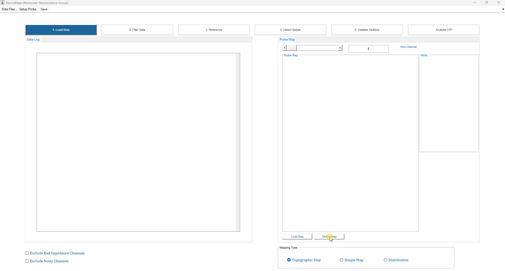
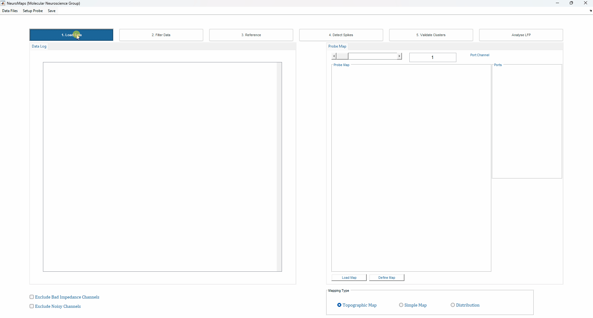
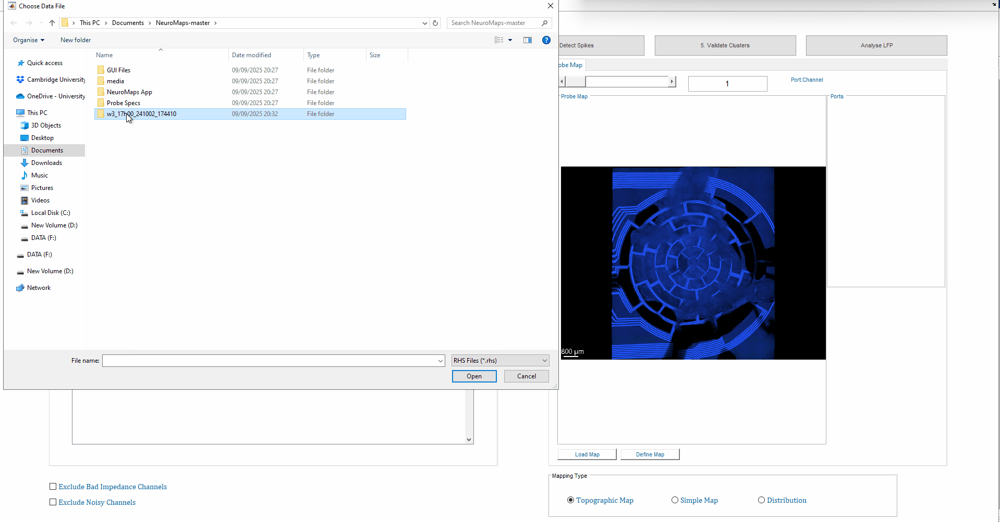
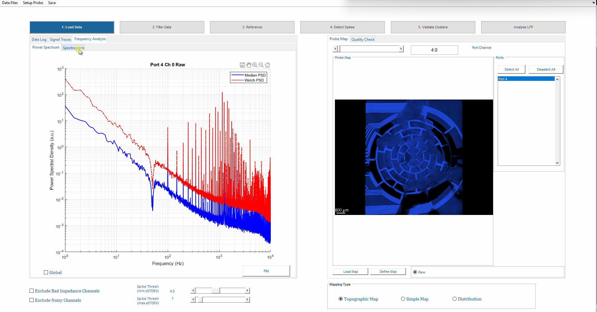
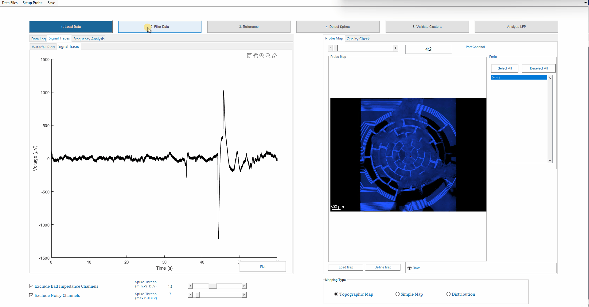
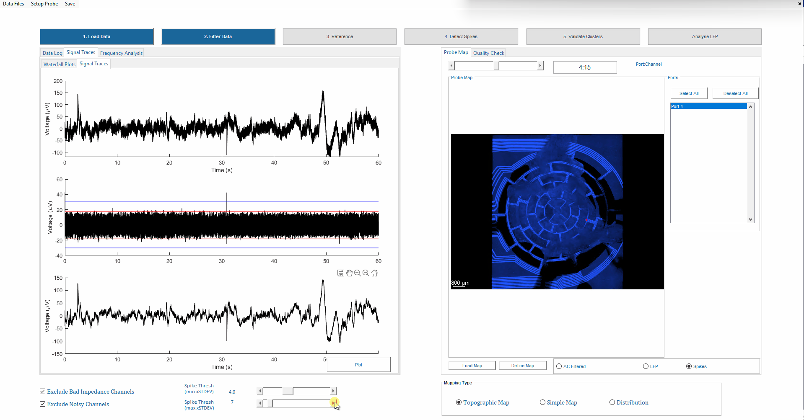
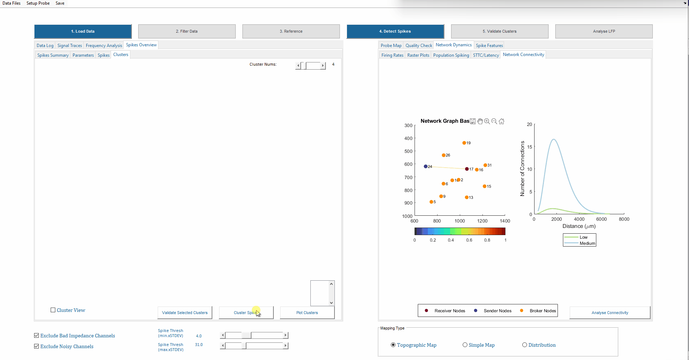

# NeuroMaps

---

## Overview
NeuroMaps is a MATLAB GUI for processing, analysing, and visualising multi-channel electrophysiological recordings. It integrates spike, LFP, and network-level metrics into a central data structure for fast analysis, quality control, and downstream statistics.

**Key benefits:**
- Unified analysis pipeline for spikes, LFPs, and network metrics  
- Interactive GUI for quality control and visualization  
- Supports multi-experiment and batch analysis  

---

## Features
| Category | Description |
|----------|-------------|
| Supported Files | .rhs and .rhd (Intan Tech) ; .h5 (MCS)|
| Signal Visualization | Raw and filtered traces, waterfall plots |
| Spike Analysis | Detection, clustering, ISI, bursts, amplitude, FWHM, phase plots (dV/dt) |
| Frequency & Spectral Analysis | PSD, spectrograms, CWT, bandpower, FOOOF fitting |
| Phase & Coupling Metrics | Bandpower, PAC, oscillatory and exponent analysis |
| Network Dynamics | Firing rate heatmaps, raster plots, STTC, connectivity matrices |
| Quality Control | Electrical properties per channel, QC flags, interactive curation |
| Probe Map Integration | Spatial layout of channels, custom probe configurations |
| Batch Analysis | Upload multiple experiments, align longitudinal data, cluster spikes across sessions, compute spike features, automatically perform Kruskal-Wallis and t-tests, visualise PCA across clusters and experiments |

---

## System Requirements
| Component | Requirement |
|-----------|------------|
| MATLAB | 2024a or higher |
| Toolboxes | Signal Processing, Statistics & Machine Learning, Wavelet, Econometrics, Mapping |
| Python (optional) | 3.11 (for FOOOF & MATLAB-Python interface) |
| Hardware | Minimum 1.3 GHz CPU, 16 GB RAM recommended |

---

## Python Setup (MATLAB Integration)
1. Check Python configuration in MATLAB: `pyenv`  
2. Set Python version using Python 3.11 path (e.g., `C:\Users\User\appdata\local\programs\python\python311\pythonw.exe`) with execution mode `'OutOfProcess'`  
3. Install required packages: `numpy`, `scipy`, `matplotlib`, `fooof`  
4. Restart MATLAB before running NeuroMaps  

---

## Installation
1. Clone or download this repository  
2. Add the `NeuroMaps` folder and all subfolders to your MATLAB path  
3. Launch the GUI: run `NeuroMaps` or open `NeuroMaps.m`

---

## Usage
### Setup Probe

1. Click on **Probe Map Tab → Define Map**  
2. Upload a photo containing the design or the image of interest  
3. Use your mouse to zoom/pan to locate each electrode  
4. Press **Enter** to confirm the selection for an electrode; repeat for all electrodes  
5. Once all electrodes are selected, **double-press Enter** to confirm the map  
6. Save the probe at a desired location  
7. Load the map before proceeding via **Probe Map Tab → Load Map**  

💡 **Tip:** Use Backspace to delete any incorrectly selected electrode location  

⚠️ **Warning:** Electrodes will be labelled 0, 1, 2… This may not be compatible with MCS configuration, but it can be modified manually by editing the `'maps'` array in the probe map file. Future versions of **NeuroMaps** will handle this automatically

---

### Upload and Visualise
1. Upload recordings via **Data Files → Upload** (multiple files per session supported)
  

2. Inspect signals and QC:
   **Signal Traces Tab**: Waterfall plots and signal traces
   **Quality Checks Tab**: Electrical properties, noise levels, QC flags  
   **Probe Map**: Channel position displayed (Port:Channel slider)  

3. Inspect power spectral density curves and spectrogram locally or plot the global PSD (mean of PSD from channels - with or without exclusion criteria)

4. Apply exclusion criteria and perform referencing or filtering. New toggles for Raw/Filtered views will be available and can be used to update the waterplots, PSD, spectrogram, and continuous wavelet transform (CWT) plots.

💡 **Tip:**
- It may be useful to increase the spike detection range to 6000 Hz to detect fast-spiking events
- When changing the time range for the waterfall plot or CWT, always press enter

⚠️ **Warnings:**
- CWT will only be generated using the LFP signals
- In future additions, manual channel curation will be implemented

---

### Spike Detection Route
#### Detection and Inspection
1. Exclude bad channels with toggle at bottom
2. Set spike threshold using the sliders at the bottom of the screen 
3. Detect spikes  
4. View firing rates, raster plots, network connectivity, STTC, spike features

#### Clustering
1. Cluster spikes using PCA/K-Means or PCA/Gaussian Mixture Model or Gaussian Mixture Model. You could view the clusters per channel or in separate subplot using the **Cluster View Toggle**

---

### LFP Analysis Route
1. Run FOOOF analysis, inspect oscillatory/exponent heatmaps  
2. Measure bandpowers and perform PAC analysis after inspecting raster plots
analysis  

---

### Multi-Experiment / Batch Analysis
1. Upload multiple experiment files and compare/re-process or proceed to longitudinal analysis.
2. Run automated spike detection and clustering across experiments.
3. Analyse longitudinal activity and comparative metrics.
4. Perform automatic statistical analysis (Kruskal-Wallis, t-tests).
5. Inspect PCA projections across clusters and experiments.
6. Produce barplots and boxplots for comparisons.
7. Export data for downstream analysis.
---

### Save and Export
1. Save GIFs of spike activity via **Save → Save GIF**  
2. Export processed data for multi-experiment analysis via **Save → Save Data**  

---

## Performance
- Analysis speed depends on CPU, RAM, and disk  
- Recommended: process files ≤5 minutes (initial analysis: 1-minute segments)  

---

## Citation
If you use NeuroMaps in your research, please cite it appropriately.

Haider, B., Middya, S., Lloyd-Davies-Sánchez, D., Laubli, N., Vora, S., Träuble, J., Krajeski, R., Serrano, R. R.-M., Paulsen, O., Lancaster, M., Malliaras, G. G.,Schierle, G. K. (2025). NeuroSuite for Long-term Functional and Structural Studies of Air-Liquid Interface Cerebral Organoids. <i>BioRxiv</i>, 2025.07.16.663353. https://doi.org/10.1101/2025.07.16.663353

## References
- Berens, P. CircStat: a MATLAB toolbox for circular statistics. J. Stat. Softw. 31, 1–21 (2009)  
- Bounova, G. & De Weck, O. Overview of metrics and correlation patterns for multiple-metric topology analysis. Phys. Rev. E 85, 1–11 (2012)  
- Cutts, C. S. & Eglen, X. S. Detecting pairwise correlations in spike trains. J. Neurosci. 34, 14288–14303 (2014)  
- Souza, B. C., Lopes-dos-Santos, V., Bacelo, J., & Tort, A. B. Spike sorting with Gaussian mixture models. Sci. Rep. 9, 3627 (2019)  
- Giandomenico, S. L. et al. Cerebral organoids at the air–liquid interface. Nat. Neurosci. 22, 669–679 (2019)  
- Quiroga, R. Q., Nadasdy, Z. & Ben-Shaul, Y. Unsupervised spike detection with wavelets and superparamagnetic clustering. Neural Comput. 16, 1661–1687 (2004)  
- Sharf, T., Van Der Molen, T., Glasauer, S. M., et al. Functional neuronal circuitry in human brain organoids. Nat. Commun. 13, 4403 (2022)  
- Trujillo, C. A., Gao, R., Negraes, P. D., et al. Complex oscillatory waves in cortical organoids. Cell Stem Cell 25, 558–569 (2019)
