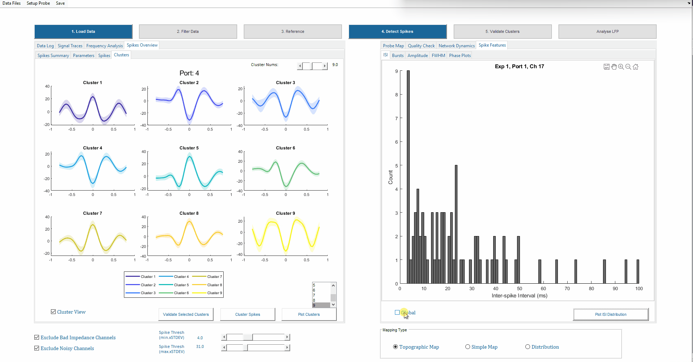
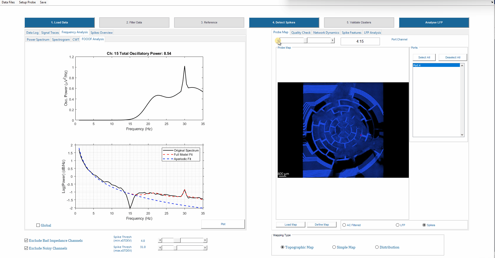
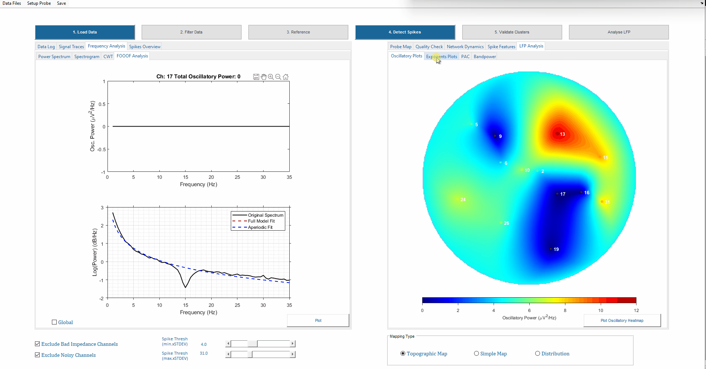
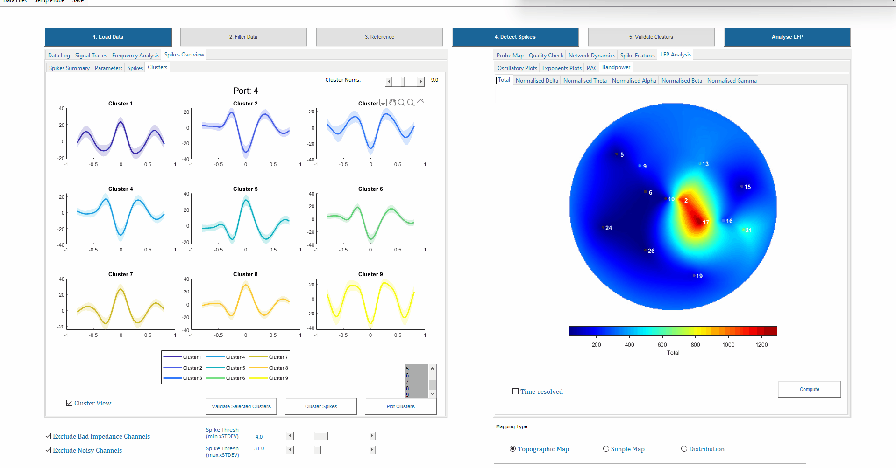
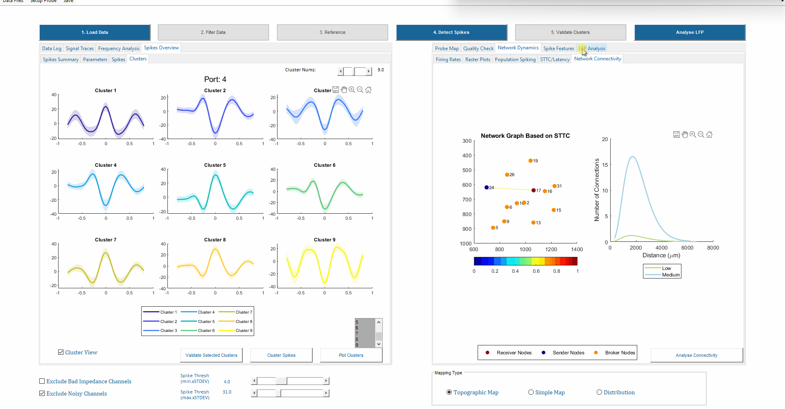
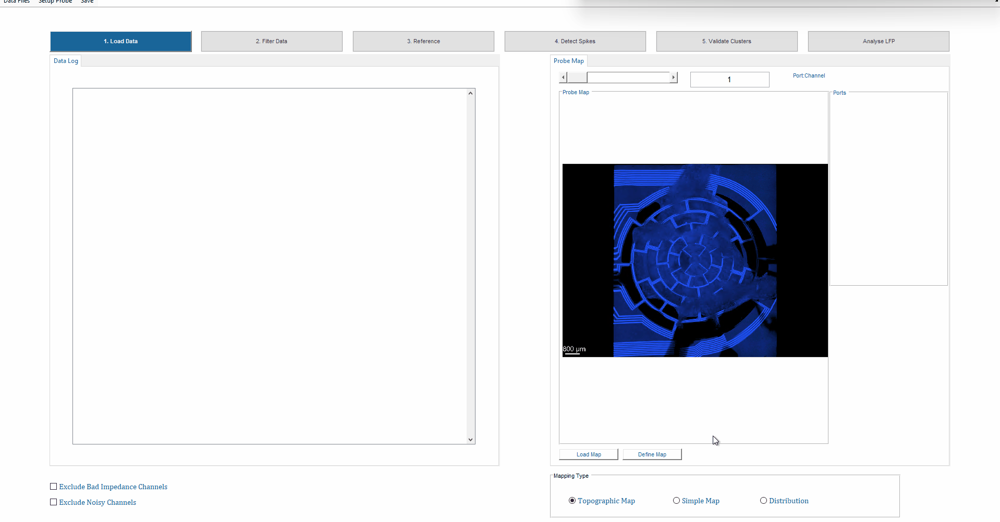
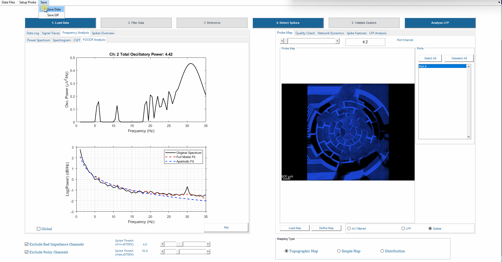
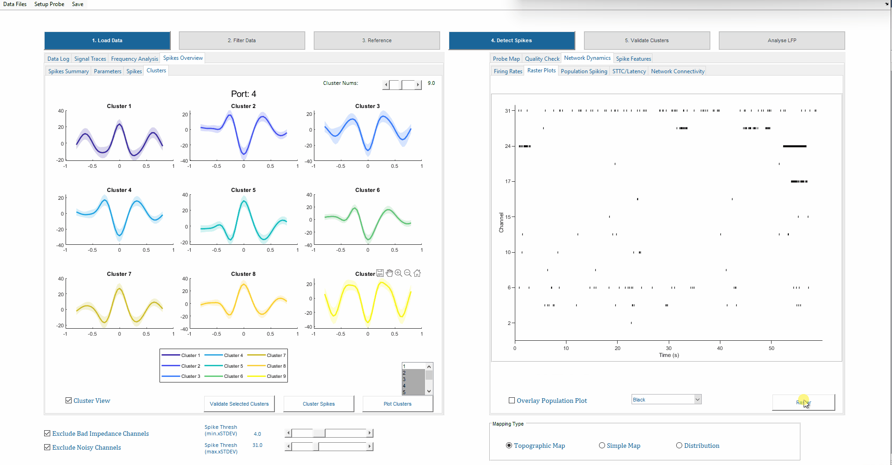
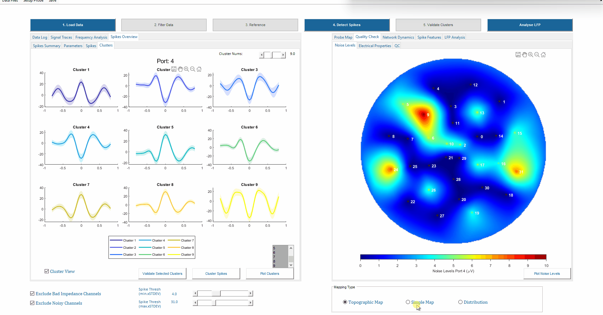
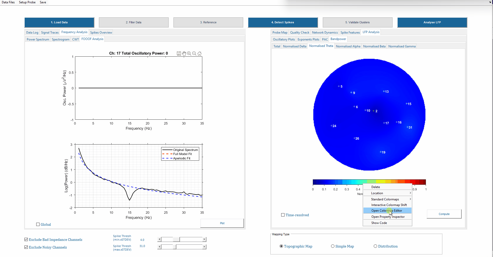

# NeuroMaps

---

## Overview
NeuroMaps is a MATLAB GUI for processing, analysing, and visualising multi-channel electrophysiological recordings. It integrates spike, LFP, and network-level metrics into a central data structure for fast analysis, quality control, and downstream statistics.

**Key benefits:**
- Unified analysis pipeline for spikes, LFPs, and network metrics  
- Interactive GUI for quality control and visualisation  
- Supports multi-experiment and batch analysis  

---

## Features
| Category | Description |
|----------|-------------|
| Supported Files | .rhs and .rhd (Intan Tech) ; .h5 (MCS)|
| Signal Visualization | Raw and filtered traces, waterfall plots |
| Spike Analysis | Detection, clustering, ISI, bursts, amplitude, FWHM, phase plots (dV/dt) |
| Frequency & Spectral Analysis | PSD, spectrograms, CWT, bandpower, FOOOF fitting |
| Phase & Coupling Metrics | Bandpower, PAC, oscillatory and exponent analysis |
| Network Dynamics | Firing rate heatmaps, raster plots, STTC, connectivity matrices |
| Quality Control | Electrical properties per channel, QC flags, interactive curation |
| Probe Map Integration | Spatial layout of channels, custom probe configurations |
| Batch Analysis | Upload multiple experiments, align longitudinal data, cluster spikes across sessions, compute spike features, automatically perform Kruskal-Wallis and t-tests, visualise PCA across clusters and experiments |

---

## System Requirements
| Component | Requirement |
|-----------|------------|
| MATLAB | 2024a or higher |
| Toolboxes | Signal Processing, Statistics & Machine Learning, Wavelet, Econometrics, Mapping |
| Python (optional) | 3.11 (for FOOOF & MATLAB-Python interface) |
| Hardware | Minimum 1.3 GHz CPU, 16 GB RAM recommended |

---

## Python Setup (MATLAB Integration, Optional)
1. Check Python configuration in MATLAB: `pyenv`  
2. Set Python version using Python 3.11 path (e.g., `C:\Users\User\appdata\local\programs\python\python311\pythonw.exe`) with execution mode `'OutOfProcess'`  
3. Install required packages: `numpy`, `scipy`, `matplotlib`, `fooof`  
4. Restart MATLAB before running NeuroMaps  

---

## Installation
1. Clone or download this repository  
2. Add the `NeuroMaps` folder and all subfolders to your MATLAB path  
3. Launch the GUI: run `NeuroMaps` or open `NeuroMaps.m`

An exetuble file can also be found on Zenodo: 10.5281/zenodo.19120269

---

## Usage
### Setup Probe

1. Click on **Probe Map Tab → Define Map**  
2. Upload a photo containing the design or the image of interest  
3. Use your mouse to zoom/pan to locate each electrode
4. You will first be prompted to calibrate the pixel:\mum ratio for downstream correlation maps.
💡 **Tip:** Using a scalebar can be helpful for calibration.
6. Press **Enter** to confirm the selection for an electrode; repeat for all electrodes  
7. Once all electrodes are selected, **double-press Enter** to confirm the map  
8. Save the probe at a desired location  
9. Load the map before proceeding via **Probe Map Tab → Load Map**  

💡 **Tip:** Use Backspace to delete any incorrectly selected electrode location  

⚠️ **Warning:** Electrodes will be labelled 0, 1, 2… This may not be compatible with MCS configuration, but it can be modified manually by editing the `'maps'` array in the probe map file. Future versions of **NeuroMaps** will handle this automatically

---

### Upload and Visualise
1. Upload recordings via **Data Files → Upload** (multiple files per session supported)

  

2. Inspect signals and QC:
   **Signal Traces Tab**: Waterfall plots and signal traces
   **Quality Checks Tab**: Electrical properties, noise levels, QC flags  
   **Probe Map**: Channel position displayed (Port:Channel slider)  

3. Inspect power spectral density curves and spectrogram locally or plot the global PSD (mean of PSD from channels - with or without exclusion criteria)

4. Apply exclusion criteria and perform referencing or filtering. New toggles for Raw/Filtered views will be available and can be used to update the waterplots, PSD, spectrogram, and continuous wavelet transform (CWT) plots.

💡 **Tip:**
- It may be useful to increase the spike detection range to 6000 Hz to detect fast-spiking events
- When changing the time range for the waterfall plot or CWT, always press enter
- Make sure the settings are appropriate for your dataset.
- Use the toggles 'AC Filtered', 'Spikes', 'LFP' and update the waterfall maps to reflect the current selection.

⚠️ **Warnings:**
- CWT will only be generated using the LFP signals
- In future additions, manual channel curation will be implemented

---

### Spike Detection Route
#### Data Referencing
Referencing can be applied to attenuate common mode noise in extracellular recordings. NeuroMaps currently supports two 'global' referencing modules:
- Average reference (subtracts mean of all included channels from each channel)
- Median reference (subtracts median of all included channels from each channel)
Median referencing is recommended to avoid biasing the data during periods of high activity.
If common mode noise is minimal (i.e., artefacts do not appear simultaneously across active, non-excluded channels), this step can be skipped.

Before applying referencing:
- Enable "Exclude Bad Impedance Channels"
- Optionally enable "Exclude Noisy Channels" to prevent corrupted inputs from distorting the reference.
- Select the high-pass filtered data ('Spikes') under the Probe Map, this ensures that the signals are not distorted due to slow oscillations.

#### Detection and Inspection
1. Exclude bad channels with toggle at bottom
2. Set spike threshold using the boxes at the bottom of the screen 
3. Detect spikes  
4. View firing rates, raster plots, network connectivity, STTC, spike features

#### Clustering
1. Cluster spikes using PCA/K-Means or PCA/Gaussian Mixture Model or Gaussian Mixture Model. You could view the clusters per channel or in separate subplot using the **Cluster View Toggle**

2. Inspect spike features such as ISI, Bursts, Amplitude, and FWHM histograms for specific clusters at an electrode level or globally across all electrodes

---

### LFP Analysis Route
1. Run FOOOF analysis, inspect fitted plots for local/global analysis (similar to PSDs)

2. Inspect oscillatory/exponent/bandpower heatmaps

3. Apply time-resolved bandpower if needed

4.   Inspect connectivity and perform PAC analysis on selected channels

---

### Multi-Experiment / Batch Analysis
1. Upload multiple experiment files and compare/re-process or proceed to longitudinal analysis.
2. Run automated spike detection and clustering across experiments.
3. Analyse longitudinal activity and comparative metrics.
4. Perform automatic statistical analysis (Kruskal-Wallis, t-tests).
5. Inspect PCA projections across clusters and experiments.
6. Produce barplots and boxplots for comparisons.
7. Export data for downstream analysis.

---

### Save and Export
1. Save GIFs of spike activity via **Save → Save GIF**. You can set how often you would like to average the waveforms (e.g. 3 seconds) and the delay time in s between frames.

  
  
2. Export processed data for multi-experiment analysis via **Save → Save Data**

⚠️ **Warnings:**
- Saving all metadata comes at the cost of subsequent computation power and storage space
- Metadata selection may enable downstream re-processing

---

### Supported Plotting Modes
#### Raster Plots
- Multiple raster plot modes are supported including:
  **Plain Rasters** spike time stamps plotted in black
  **Amplitude Rasters** spike time stamps colour-coded based on amplitude
  **Cluster Rasters** identification of cluster occurance globally
  **Burst Rasters** bursts are overlayed in red on plain rasters

   

#### Heatmap Plots
- Heatmap plots can be customised as Topographic, Simple, or Distribution

#### Edit Colourmap Limits
- You can use MATLAB built-in editor which is enabled on all plots to customise colourmap ranges.

## Performance
- Analysis speed depends on CPU, RAM, and disk  
- Recommended: process files ≤5 minutes (initial analysis: 1-minute segments)  

## FAQs
Q: What is "Binarisation Rate" in population spike plots?
A: The binarisation rate sets how many time bins per second are used to convert spike times into a binary matrix. For example, a rate of 1000 Hz means 1 ms bins. 
- Higher rates would yield finer temporal resolution, capturing fast bursts, but can be sparser and noisier.
- Lower rates would yield coarser bins, smoother population trends, and can be better for slower network events.
Q: What does the other default spike threshold (7) indicate?
A: Dual thresholding is used to omit non-biological signals. 7 is the max. standard deviations above which spikes are omitted and it is plotted as a blue horizontal line on top of the signal traces.

Q: How does validating clusters work?
A: After clustering, the user can first select desired clusters and plot the corresponding firing rates, features, etc.. on the right panel to explore if any clusters/spikes are to be excluded. Once the user decided which clusters to keep, validate selected cluster locks these into the final results deleting other spikes/computed features which do not belong to the selected clusters.

Q: Averaging results for different trials and doing statistics with results 
A: This functionality is currently available on analysed datasets (for multi-experiment analysis). Averages currently appear in the spike summary.
To generate comparative box-plots go to Cumulative Analysis Tab  and either compute:
- Stats: When you click on Compute, you can select from the available list what features you would like to compare and if you would like to compare statistics. Stats are only computed if there are more than 2 groups and more than 2 data points per group compared. Please note, when data is not available for a specific metric, a warning dialog box will appear.
- Evolution: this is appropriate when tracking longitudinal developmental changes in the sample. You will be prompted to enter sample age and start date for each experiment, for instance if I know that my organoids from Exp. 1 and Exp. 2 were DIV 110 and DIV 120 respectively on 2025-10-02;  NeuroMaps can automatically infer the corresponding ‘ages’ and produce boxplots based on the time-resolution required: “Days”, “weeks”, or “months”

---

## Citation
If you use NeuroMaps in your research, please cite it appropriately.

Haider, B., Middya, S., Lloyd-Davies-Sánchez, D., Laubli, N., Vora, S., Träuble, J., Krajeski, R., Serrano, R. R.-M., Paulsen, O., Lancaster, M., Malliaras, G. G.,Schierle, G. K. (2025). NeuroSuite for Long-term Functional and Structural Studies of Air-Liquid Interface Cerebral Organoids. <i>BioRxiv</i>, 2025.07.16.663353. https://doi.org/10.1101/2025.07.16.663353

## References
- Berens, P. CircStat: a MATLAB toolbox for circular statistics. J. Stat. Softw. 31, 1–21 (2009)  
- Bounova, G. & De Weck, O. Overview of metrics and correlation patterns for multiple-metric topology analysis. Phys. Rev. E 85, 1–11 (2012)  
- Cutts, C. S. & Eglen, X. S. Detecting pairwise correlations in spike trains. J. Neurosci. 34, 14288–14303 (2014)  
- Souza, B. C., Lopes-dos-Santos, V., Bacelo, J., & Tort, A. B. Spike sorting with Gaussian mixture models. Sci. Rep. 9, 3627 (2019)  
- Giandomenico, S. L. et al. Cerebral organoids at the air–liquid interface. Nat. Neurosci. 22, 669–679 (2019)  
- Quiroga, R. Q., Nadasdy, Z. & Ben-Shaul, Y. Unsupervised spike detection with wavelets and superparamagnetic clustering. Neural Comput. 16, 1661–1687 (2004)  
- Sharf, T., Van Der Molen, T., Glasauer, S. M., et al. Functional neuronal circuitry in human brain organoids. Nat. Commun. 13, 4403 (2022)  
- Trujillo, C. A., Gao, R., Negraes, P. D., et al. Complex oscillatory waves in cortical organoids. Cell Stem Cell 25, 558–569 (2019)
